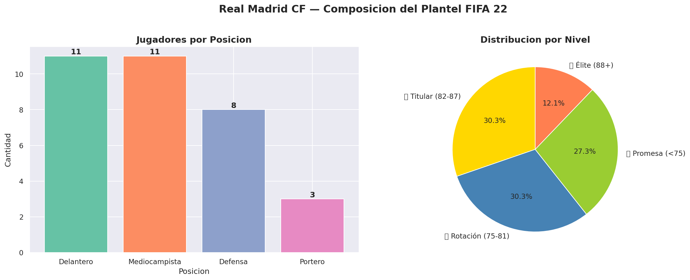
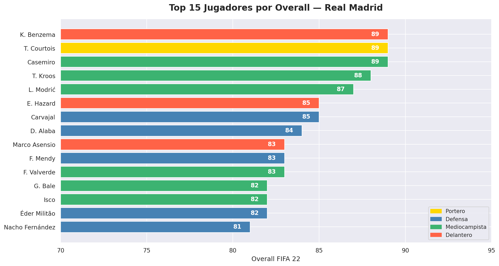
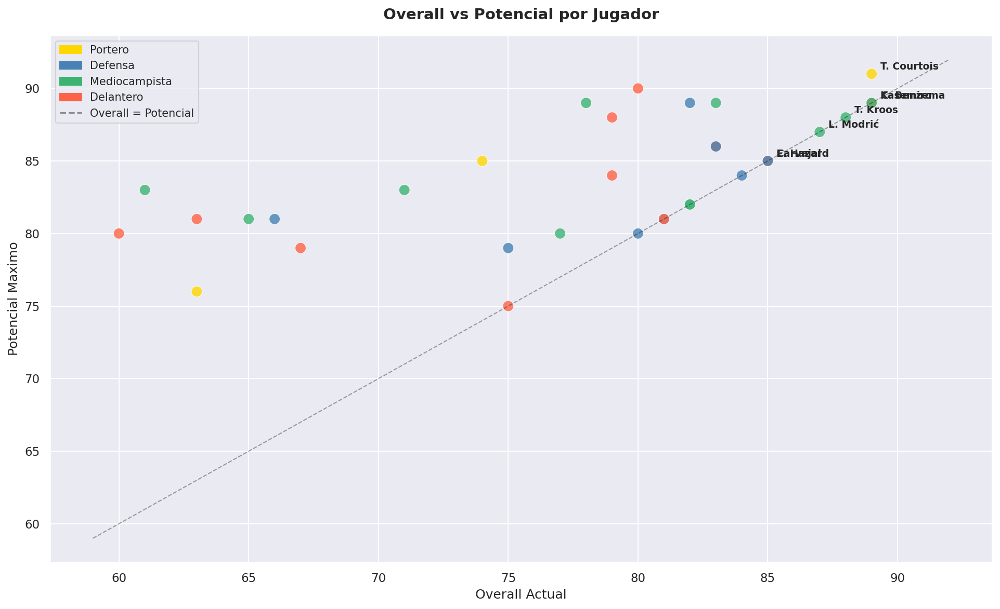
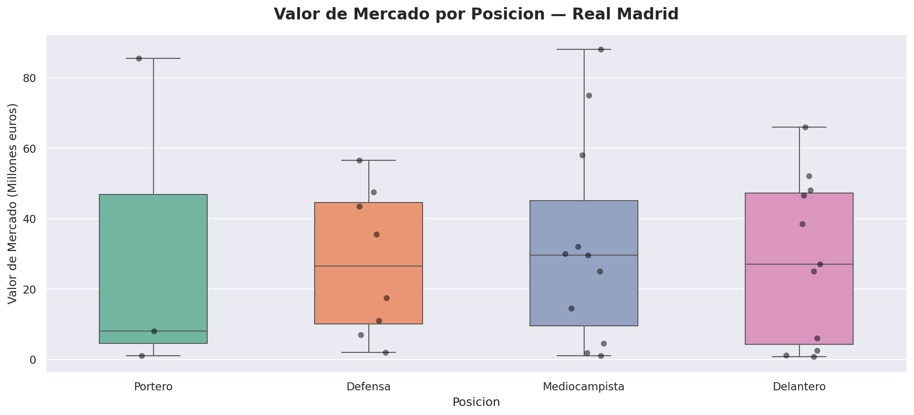
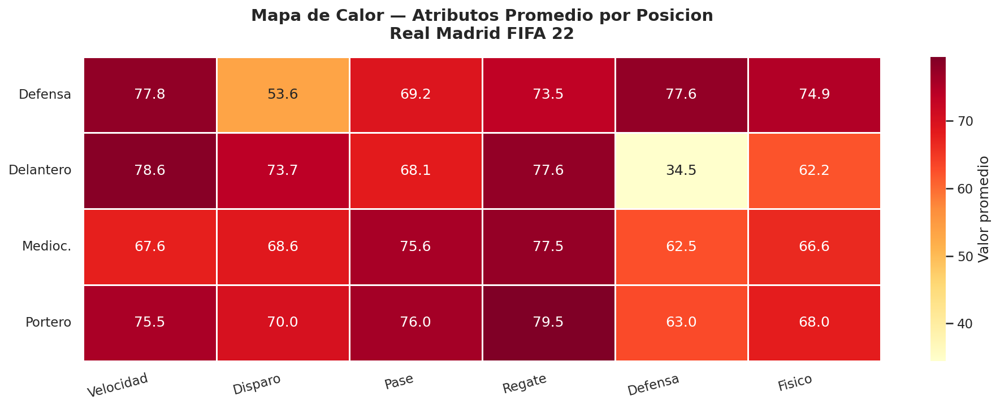
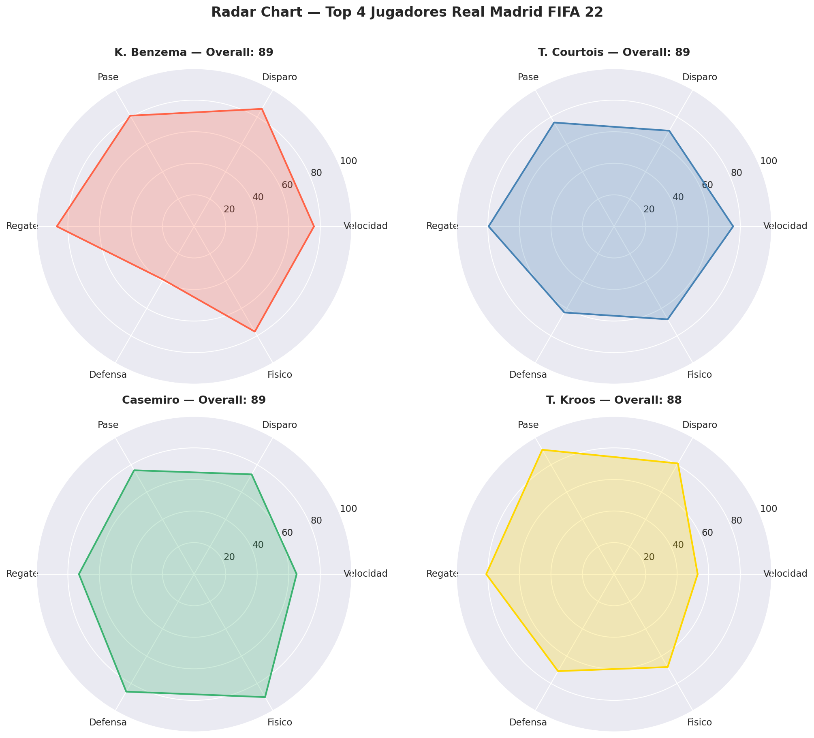
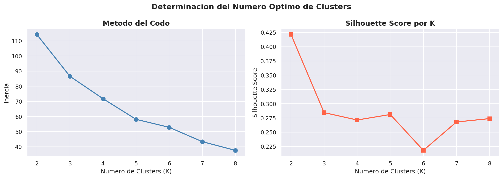
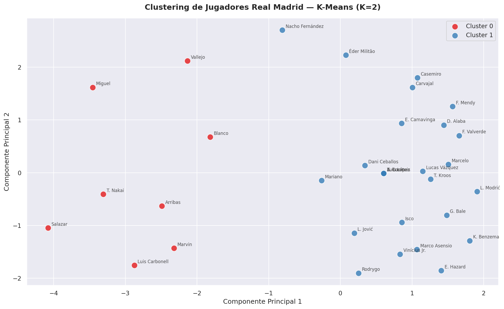

# Analisis de Rendimiento de Jugadores — Real Madrid FIFA 22


---

## Descripcion

Este proyecto analiza el rendimiento y perfil de los jugadores
del **Real Madrid CF** usando datos de FIFA 22. A través de
visualizaciones avanzadas y Machine Learning (K-Means clustering),
se identifican patrones de desempeño y se agrupan los jugadores
por similitud de características.

> *"¿Qué tienen en común los mejores jugadores del mundo?"*

---

## Objetivos

- Explorar el perfil de habilidades del plantel completo
- Identificar jugadores con mayor potencial de crecimiento
- Analizar el valor de mercado por posición
- Agrupar jugadores por similitud usando K-Means
- Comunicar hallazgos con visualizaciones avanzadas

---

## Preguntas que responde este análisis

1. ¿Cuál es el perfil de habilidades por posición?
2. ¿Qué jugadores tienen más margen de mejora?
3. ¿Qué posición concentra mayor valor de mercado?
4. ¿Qué perfiles naturales existen en el plantel?
5. ¿Coincide el clustering con las posiciones reales?

---

## Visualizaciones principales

| Grafico | Descripcion |
|---------|-------------|
|  | Composicion del plantel |
|  | Top 15 por overall |
|  | Overall vs Potencial |
|  | Valor de mercado por posicion |
|  | Mapa de calor de atributos |
|  | Radar chart top 4 jugadores |
|  | Metodo del codo — K optimo |
|  | Clustering PCA 2D |

---

## Machine Learning

Se aplicó **K-Means Clustering** para agrupar jugadores
por similitud de atributos FIFA.

### Resultados

| Cluster | Perfil | Jugadores |
|---------|--------|-----------|
| Cluster 0 | Especialistas defensivos/porteros | 8 jugadores |
| Cluster 1 | Jugadores de campo completos | 25 jugadores |

### Hallazgo clave
El clustering con K=2 captura de forma natural la división
entre **especialistas defensivos** y **jugadores de campo
completos**, validando que los atributos FIFA reflejan
correctamente los roles dentro del equipo.

---

## Estructura del proyecto
```
realmadrid-fifa22/
│
├── images/
│   └── (todas las visualizaciones)
│
├── Analisis_Rendimiento_RealMadrid.ipynb
├── README.md
└── requirements.txt
```

---

## Tecnologias utilizadas

- **Python 3.12**
- **Pandas** — manipulacion de datos
- **Matplotlib / Seaborn** — visualizacion avanzada
- **Scikit-learn** — K-Means, PCA, StandardScaler
- **Google Colab** — entorno de desarrollo
- **GitHub** — control de versiones

---

## Como ejecutar el proyecto

1. Clona el repositorio:
```bash
git clone https://github.com/George1902/realmadrid-fifa22.git
```

2. Instala las dependencias:
```bash
pip install -r requirements.txt
```

3. Descarga el dataset desde Kaggle:
   [FIFA 22 Complete Player Dataset](https://www.kaggle.com/datasets/stefanoleone992/fifa-22-complete-player-dataset)
   y colócalo en la raíz del proyecto

4. Abre el cuaderno en Google Colab o Jupyter

---

## requirements.txt
```
pandas
matplotlib
seaborn
scikit-learn
jupyter
```

---

## Fuente de datos

**FIFA 22 Complete Player Dataset**
Autor: Stefano Leone — Kaggle
Dataset: https://www.kaggle.com/datasets/stefanoleone992/fifa-22-complete-player-dataset

---

## Autor

**Jorge Ojeda**
Estudiante — Oracle Next Education (ONE) — Alura LATAM
Especializacion: Ciencia de Datos
2026

---

## Licencia

Proyecto de uso educativo y libre distribucion.
Los datos pertenecen a Kaggle y están disponibles
públicamente bajo licencia Creative Commons.
